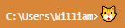

Replace your [Hyper](https://hyper.is/) cursor with a curious kitten!

Inspired by [hyper-cat-cursor](https://github.com/balazssagi/hyper-cat-cursor) and based on a fork of Aaronius' [hyper-cat](https://github.com/Aaronius/hyper-cat).

## In the future

- Config including animations/scaling.

- Because of issues with scroll events on Windows the cat will currently follow you around when scrolling. This will be fixed in a future update! In the meantime, just start typing and the cat will be back where it belongs :)

- Remove/polish code.
